# Checkpoint 04A — Target topology, similarity and support

Generated: 2026-09-20T17:35:47.525361+00:00
Git commit: a21703845646689903a590651bd822285097b77b

## Objective

Characterize the exact 59 fixed target parcels relative to the 138 labeled parcels.
Target covariates are used transductively. The 59 hidden FIRA yields are never accessed.

The support score is diagnostic. It is not a predicted yield or a calibrated probability.

## Data

- 197 parcels = 138 labeled + 59 targets
- temporal series found: 11
- labeled-labeled pairs evaluated: 9453
- target-labeled temporal pairs evaluated: 8142

## Transductive PCA representations

| representation | n_features_used | n_components | explained_variance_ratio_sum |
|---|---|---|---|
| C0_base | 1397 | 20 | 0.7885 |
| C1_agronomic | 350 | 20 | 0.9031 |
| C4_all_deterministic | 2082 | 20 | 0.7684 |

## Covariate shift

Cross-validated adversarial AUC: **0.4892**.
AUC near 0.5 means weak separation; larger AUC means the target X distribution is more distinguishable.

Largest standardized train-target mean shifts:

| feature | standardized_mean_difference | train_missing_fraction | target_missing_fraction |
|---|---|---|---|
| sat_basic_hist_monthly__sentinel_2__enddi_promedio__m08 | -0.5343 | 0.0000 | 0.0000 |
| sat_basic_hist_monthly__sentinel_2__dswi2_promedio__m08 | -0.5303 | 0.0000 | 0.0000 |
| sat_basic_hist_monthly__sentinel_2__mcrc_promedio__m08 | -0.5296 | 0.0000 | 0.0000 |
| sat_basic_hist_monthly__sentinel_2__crc_promedio__m08 | -0.5035 | 0.0000 | 0.0000 |
| sat_basic_hist_monthly__sentinel_2__srndi_promedio__m08 | -0.4994 | 0.0000 | 0.0000 |
| sat_basic_hist_monthly__sentinel_2__nddi_promedio__m08 | -0.4790 | 0.0000 | 0.0000 |
| emp_shape__hist_s2_lai__lag1_autocorr | 0.4540 | 0.0000 | 0.0000 |
| sat_basic_hist_monthly__sentinel_2__msi_promedio__m07 | -0.4082 | 0.0000 | 0.0000 |
| sat_basic_hist_monthly__sentinel_2__ndwi_promedio__m07 | 0.4035 | 0.0000 | 0.0000 |
| emp_shape__hist_s2_evi__lag1_autocorr | 0.3957 | 0.0000 | 0.0000 |
| sat_basic_hist_monthly__sentinel_2__dswi5_promedio__m06 | 0.3949 | 0.0000 | 0.0000 |
| sat_basic_hist_monthly__sentinel_2__fapar_promedio__m06 | 0.3932 | 0.0000 | 0.0000 |
| agro_pheno__hist_s2_ndwi__auc | 0.3823 | 0.0000 | 0.0000 |
| sat_basic_hist_monthly__sentinel_2__ndsvi_promedio__m08 | -0.3787 | 0.0000 | 0.0000 |
| emp_shape__hist_s2_evi__roughness | -0.3747 | 0.0000 | 0.0000 |
| agro_pheno__hist_s2_msi__auc | -0.3735 | 0.0000 | 0.0000 |
| agro_pheno__hist_s2_fapar__early_mean | 0.3701 | 0.0000 | 0.0000 |
| sat_basic_hist_monthly__sentinel_2__emsi_promedio__m07 | -0.3663 | 0.0000 | 0.0000 |
| sat_basic_hist_monthly__sentinel_2__dswi5_promedio__m07 | 0.3650 | 0.0000 | 0.0000 |
| emp_shape__hist_s2_lai__shape_entropy | 0.3645 | 0.0000 | 0.0000 |

## Does similarity transfer yield?

Spearman associations below use only pairs among the 138 labeled parcels.

| metric | n_pairs | spearman_rho_with_abs_yield_difference | p_value | expected_direction_if_useful |
|---|---|---|---|---|
| geo_distance_km | 9453 | 0.4882 | 0.0000 | positive |
| C1_agronomic__distance | 9453 | 0.2200 | 0.0000 | positive |
| C4_all_deterministic__distance | 9453 | 0.1833 | 0.0000 | positive |
| C0_base__distance | 9453 | 0.1673 | 0.0000 | positive |
| temporal_dtw_mean | 9453 | 0.0763 | 0.0000 | positive |
| temporal_pearson_mean | 9453 | -0.0503 | 0.0000 | positive |
| temporal_best_lag_corr_mean | 9453 | -0.0482 | 0.0000 | negative |

## Spatial autocorrelation

| signal | morans_i | expected_i | permutation_p_value_two_sided | permutations |
|---|---|---|---|---|
| yield | 0.6797 | -0.0073 | 0.0010 | 999.0000 |
| E13_fold_state_stratified_residual | -0.0470 | -0.0073 | 0.3140 | 999.0000 |
| E123_fold_state_stratified_residual | -0.0375 | -0.0073 | 0.4290 | 999.0000 |
| E13_fold_municipality_grouped_residual | 0.5589 | -0.0073 | 0.0010 | 999.0000 |
| E123_fold_municipality_grouped_residual | 0.5483 | -0.0073 | 0.0010 | 999.0000 |

## Support taxonomy

| support_tier | n_targets |
|---|---|
| A_high_support | 5 |
| B_feature_supported | 2 |
| C_geographic_supported | 5 |
| D_extrapolation | 13 |
| E_mixed_support | 34 |

### All 59 target parcels

| ID_POLIGONO | meta_estado | meta_municipio | support_score | support_tier | nearest_geo_train_id | nearest_geo_km | nearest_feature_train_id | nearest_feature_distance | nearest_temporal_train_id | nearest_temporal_similarity | feature_neighbor_y_mean | feature_neighbor_y_sd | adversarial_target_probability |
|---|---|---|---|---|---|---|---|---|---|---|---|---|---|
| AGC_088 | Puebla | Chignahuapan | 0.8623 | A_high_support | AGC_165 | 0.1360 | AGC_165 | 13.2803 | AGC_165 | 0.9899 | 4.3240 | 0.2137 | 0.3111 |
| AGC_190 | Puebla | Chignahuapan | 0.7435 | A_high_support | AGC_006 | 0.2896 | AGC_006 | 16.6958 | AGC_006 | 0.9927 | 4.4420 | 0.2357 | 0.4492 |
| AGC_126 | Puebla | Chignahuapan | 0.7246 | A_high_support | AGC_111 | 0.3015 | AGC_111 | 19.8709 | AGC_111 | 0.9931 | 4.6660 | 0.2795 | 0.3548 |
| AGC_128 | Hidalgo | Almoloya | 0.7217 | A_high_support | AGC_146 | 0.2493 | AGC_184 | 17.2410 | AGC_151 | 0.9831 | 4.4860 | 0.0589 | 0.4454 |
| AGC_086 | Tlaxcala | Calpulalpan | 0.6899 | A_high_support | AGC_112 | 0.5755 | AGC_141 | 14.5083 | AGC_068 | 0.9831 | 3.4000 | 0.2000 | 0.3250 |
| AGC_039 | Tlaxcala | Calpulalpan | 0.6652 | E_mixed_support | AGC_144 | 0.4850 | AGC_144 | 12.0599 | AGC_103 | 0.9956 | 2.9000 | 0.3742 | 0.4309 |
| AGC_087 | Tlaxcala | Calpulalpan | 0.6507 | E_mixed_support | AGC_054 | 0.2250 | AGC_054 | 11.4490 | AGC_054 | 0.9903 | 2.8000 | 0.4000 | 0.6323 |
| AGC_158 | Puebla | Chignahuapan | 0.6507 | E_mixed_support | AGC_102 | 0.3427 | AGC_008 | 14.3628 | AGC_102 | 0.9935 | 4.0460 | 0.9504 | 0.3237 |
| AGC_107 | Hidalgo | Almoloya | 0.6406 | E_mixed_support | AGC_184 | 0.2011 | AGC_146 | 17.3110 | AGC_137 | 0.9705 | 4.4160 | 0.1676 | 0.4080 |
| AGC_050 | Tlaxcala | Calpulalpan | 0.6348 | B_feature_supported | AGC_019 | 0.6000 | AGC_019 | 16.3710 | AGC_103 | 0.9874 | 3.1000 | 0.3742 | 0.3365 |
| AGC_095 | Puebla | Chignahuapan | 0.6029 | E_mixed_support | AGC_181 | 0.2142 | AGC_181 | 20.3338 | AGC_171 | 0.9837 | 4.6420 | 0.2068 | 0.6751 |
| AGC_143 | Puebla | Chignahuapan | 0.6014 | E_mixed_support | AGC_090 | 0.3193 | AGC_090 | 14.1953 | AGC_189 | 0.9777 | 4.6320 | 0.2089 | 0.6182 |
| AGC_042 | Hidalgo | Singuilucan | 0.5681 | E_mixed_support | AGC_038 | 0.3166 | AGC_041 | 19.9988 | AGC_038 | 0.9838 | 2.7000 | 0.4858 | 0.4239 |
| AGC_177 | Puebla | Chignahuapan | 0.5652 | E_mixed_support | AGC_026 | 0.3646 | AGC_150 | 14.2588 | AGC_104 | 0.9744 | 4.4240 | 0.1877 | 0.5740 |
| AGC_147 | Tlaxcala | Calpulalpan | 0.5623 | B_feature_supported | AGC_144 | 1.1730 | AGC_145 | 15.9134 | AGC_144 | 0.9958 | 2.9000 | 0.3742 | 0.5428 |
| AGC_191 | Puebla | Chignahuapan | 0.5594 | E_mixed_support | AGC_057 | 0.2115 | AGC_127 | 24.5679 | AGC_069 | 0.9910 | 4.9720 | 0.4756 | 0.4885 |
| AGC_091 | Puebla | Chignahuapan | 0.5580 | E_mixed_support | AGC_167 | 0.0936 | AGC_167 | 19.5439 | AGC_013 | 0.9806 | 4.1700 | 0.7703 | 0.4166 |
| AGC_025 | Tlaxcala | Calpulalpan | 0.5406 | E_mixed_support | AGC_040 | 0.3999 | AGC_117 | 20.3228 | AGC_163 | 0.9696 | 3.3000 | 0.2449 | 0.3140 |
| AGC_071 | Tlaxcala | Calpulalpan | 0.5362 | E_mixed_support | AGC_037 | 0.1974 | AGC_058 | 14.0002 | AGC_008 | 0.9759 | 2.9000 | 0.4899 | 0.5302 |
| AGC_113 | Hidalgo | Singuilucan | 0.5348 | E_mixed_support | AGC_038 | 0.2260 | AGC_079 | 23.1240 | AGC_038 | 0.9844 | 2.9800 | 0.5036 | 0.4552 |
| AGC_156 | Hidalgo | Singuilucan | 0.5261 | E_mixed_support | AGC_140 | 0.7674 | AGC_121 | 25.3152 | AGC_137 | 0.9809 | 3.2000 | 0.1897 | 0.3486 |
| AGC_094 | Puebla | Chignahuapan | 0.5072 | C_geographic_supported | AGC_056 | 0.1872 | AGC_097 | 26.4602 | AGC_179 | 0.9827 | 4.4220 | 0.9007 | 0.3241 |
| AGC_036 | Puebla | Chignahuapan | 0.4884 | E_mixed_support | AGC_104 | 0.2967 | AGC_010 | 17.0881 | AGC_102 | 0.9612 | 4.3340 | 0.2120 | 0.8214 |
| AGC_011 | Puebla | Chignahuapan | 0.4768 | E_mixed_support | AGC_056 | 0.8393 | AGC_017 | 20.4516 | AGC_171 | 0.9867 | 4.5040 | 0.9931 | 0.3089 |
| AGC_028 | Puebla | Chignahuapan | 0.4768 | C_geographic_supported | AGC_181 | 0.2044 | AGC_060 | 33.2914 | AGC_069 | 0.9814 | 4.5760 | 0.1080 | 0.8055 |
| AGC_149 | Hidalgo | Cuautepec de Hinojosa | 0.4739 | E_mixed_support | AGC_064 | 0.2538 | AGC_064 | 16.8184 | AGC_064 | 0.9848 | 3.6760 | 0.9608 | 0.7570 |
| AGC_182 | Puebla | Chignahuapan | 0.4739 | E_mixed_support | AGC_017 | 0.4008 | AGC_176 | 20.2026 | AGC_176 | 0.9856 | 4.3140 | 0.8757 | 0.5167 |
| AGC_154 | Puebla | Chignahuapan | 0.4652 | E_mixed_support | AGC_168 | 0.2819 | AGC_131 | 24.9765 | AGC_140 | 0.9788 | 4.5400 | 0.2542 | 0.6295 |
| AGC_052 | Hidalgo | Cuautepec de Hinojosa | 0.4594 | E_mixed_support | AGC_009 | 0.2453 | AGC_064 | 22.5814 | AGC_123 | 0.9869 | 3.5220 | 0.8795 | 0.6846 |
| AGC_153 | Puebla | Chignahuapan | 0.4594 | E_mixed_support | AGC_195 | 0.5161 | AGC_062 | 18.2714 | AGC_132 | 0.9792 | 4.2120 | 0.4032 | 0.4798 |
| AGC_085 | Puebla | Chignahuapan | 0.4391 | E_mixed_support | AGC_026 | 0.2264 | AGC_026 | 15.8314 | AGC_104 | 0.9697 | 4.1480 | 0.4392 | 0.7813 |
| AGC_093 | Tlaxcala | Calpulalpan | 0.4333 | E_mixed_support | AGC_157 | 0.3697 | AGC_037 | 21.6806 | AGC_123 | 0.9780 | 3.0000 | 0.4472 | 0.4965 |
| AGC_016 | Puebla | Chignahuapan | 0.4261 | C_geographic_supported | AGC_002 | 0.1713 | AGC_150 | 29.7153 | AGC_166 | 0.9714 | 4.4240 | 0.1877 | 0.7337 |
| AGC_065 | Hidalgo | Almoloya | 0.4217 | E_mixed_support | AGC_051 | 1.9227 | AGC_059 | 26.4381 | AGC_134 | 0.9833 | 4.4120 | 0.1439 | 0.6499 |
| AGC_082 | Hidalgo | Almoloya | 0.4188 | E_mixed_support | AGC_059 | 0.4948 | AGC_189 | 28.3385 | AGC_059 | 0.9849 | 4.3920 | 0.3371 | 0.5704 |
| AGC_186 | Puebla | Chignahuapan | 0.4145 | E_mixed_support | AGC_062 | 0.5508 | AGC_100 | 21.7696 | AGC_110 | 0.9672 | 4.2920 | 0.3357 | 0.4030 |
| AGC_116 | Puebla | Chignahuapan | 0.4043 | E_mixed_support | AGC_014 | 0.2014 | AGC_105 | 20.7823 | AGC_112 | 0.9737 | 4.1600 | 0.6107 | 0.5736 |
| AGC_031 | Puebla | Chignahuapan | 0.3957 | C_geographic_supported | AGC_195 | 0.1819 | AGC_139 | 29.7535 | AGC_073 | 0.9793 | 4.3180 | 0.3761 | 0.7265 |
| AGC_027 | Tlaxcala | Calpulalpan | 0.3913 | E_mixed_support | AGC_058 | 0.5260 | AGC_103 | 28.6037 | AGC_187 | 0.9824 | 3.0000 | 0.3162 | 0.5809 |
| AGC_136 | Puebla | Chignahuapan | 0.3884 | E_mixed_support | AGC_002 | 0.1841 | AGC_010 | 24.3951 | AGC_189 | 0.9625 | 4.2760 | 0.3493 | 0.7213 |
| AGC_142 | Puebla | Chignahuapan | 0.3870 | C_geographic_supported | AGC_057 | 0.0667 | AGC_162 | 28.0955 | AGC_026 | 0.9706 | 4.8480 | 0.4267 | 0.5870 |
| AGC_192 | Puebla | Chignahuapan | 0.3783 | E_mixed_support | AGC_161 | 0.7622 | AGC_167 | 22.0527 | AGC_049 | 0.9761 | 4.3340 | 0.8784 | 0.2988 |
| AGC_075 | Tlaxcala | Calpulalpan | 0.3638 | E_mixed_support | AGC_157 | 0.3857 | AGC_058 | 22.9954 | AGC_106 | 0.9746 | 3.1000 | 0.4899 | 0.5632 |
| AGC_188 | Puebla | Chignahuapan | 0.3536 | E_mixed_support | AGC_017 | 0.3362 | AGC_124 | 24.7152 | AGC_161 | 0.9822 | 4.3520 | 0.8817 | 0.7180 |
| AGC_061 | Tlaxcala | Calpulalpan | 0.3377 | E_mixed_support | AGC_074 | 0.9878 | AGC_098 | 26.8049 | AGC_074 | 0.9820 | 3.1000 | 0.3742 | 0.6445 |
| AGC_063 | Puebla | Chignahuapan | 0.3304 | E_mixed_support | AGC_062 | 0.6197 | AGC_100 | 24.9496 | AGC_084 | 0.9611 | 4.2920 | 0.3357 | 0.5092 |
| AGC_030 | Hidalgo | Singuilucan | 0.3246 | D_extrapolation | AGC_078 | 0.5067 | AGC_079 | 25.4659 | AGC_181 | 0.9761 | 3.0400 | 0.5200 | 0.4958 |
| AGC_118 | Hidalgo | Singuilucan | 0.3188 | D_extrapolation | AGC_121 | 1.0732 | AGC_121 | 28.8396 | AGC_074 | 0.9839 | 3.1960 | 0.7606 | 0.5075 |
| AGC_174 | Hidalgo | Cuautepec de Hinojosa | 0.3116 | D_extrapolation | AGC_083 | 1.6452 | AGC_083 | 23.3867 | AGC_180 | 0.9606 | 4.6440 | 0.2056 | 0.6555 |
| AGC_130 | Hidalgo | Cuautepec de Hinojosa | 0.3087 | D_extrapolation | AGC_064 | 0.4476 | AGC_064 | 22.3803 | AGC_123 | 0.9803 | 3.4180 | 0.8776 | 0.7209 |
| AGC_129 | Hidalgo | Singuilucan | 0.3058 | D_extrapolation | AGC_081 | 0.5174 | AGC_081 | 32.4516 | AGC_045 | 0.9848 | 3.8420 | 0.5225 | 0.7408 |
| AGC_175 | Puebla | Chignahuapan | 0.2957 | D_extrapolation | AGC_017 | 0.2650 | AGC_097 | 25.7755 | AGC_159 | 0.9731 | 4.2780 | 0.8307 | 0.7044 |
| AGC_043 | Puebla | Chignahuapan | 0.2406 | D_extrapolation | AGC_105 | 0.3501 | AGC_105 | 31.3901 | AGC_159 | 0.9712 | 4.2220 | 0.6025 | 0.7020 |
| AGC_076 | Puebla | Chignahuapan | 0.2348 | D_extrapolation | AGC_168 | 0.3101 | AGC_168 | 30.0376 | AGC_049 | 0.9639 | 3.8940 | 0.8785 | 0.6863 |
| AGC_003 | Hidalgo | Singuilucan | 0.2232 | D_extrapolation | AGC_081 | 0.3823 | AGC_081 | 40.1837 | AGC_125 | 0.9649 | 4.2240 | 0.5287 | 0.6657 |
| AGC_183 | Tlaxcala | Calpulalpan | 0.1884 | D_extrapolation | AGC_163 | 1.0913 | AGC_004 | 33.1700 | AGC_146 | 0.9707 | 3.1180 | 0.7692 | 0.4994 |
| AGC_120 | Tlaxcala | Nanacamilpa de Mariano Arista | 0.1667 | D_extrapolation | AGC_054 | 1.2648 | AGC_059 | 43.7289 | AGC_046 | 0.9816 | 3.9600 | 0.8588 | 0.6804 |
| AGC_029 | Tlaxcala | Calpulalpan | 0.1246 | D_extrapolation | AGC_001 | 0.7833 | AGC_001 | 67.7977 | AGC_053 | 0.9594 | 3.1000 | 0.4899 | 0.9780 |
| AGC_173 | Tlaxcala | Calpulalpan | 0.0870 | D_extrapolation | AGC_187 | 1.7017 | AGC_084 | 87.7263 | AGC_189 | 0.9741 | 4.1720 | 0.8497 | 0.9949 |

## Figures

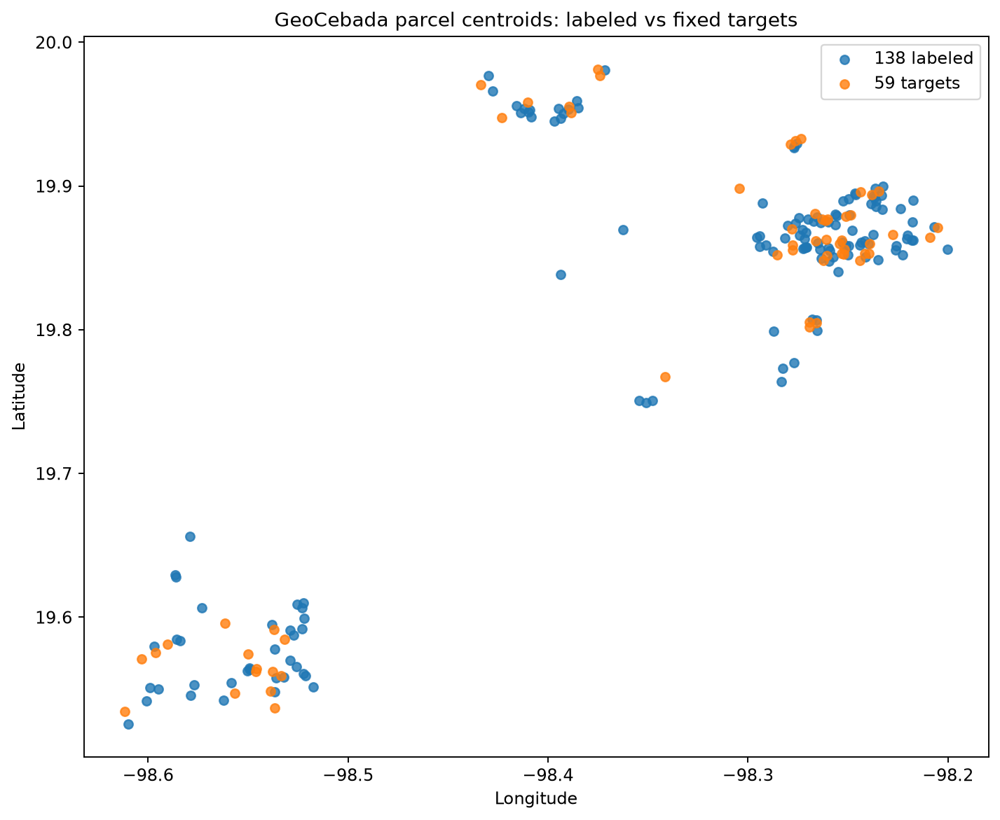

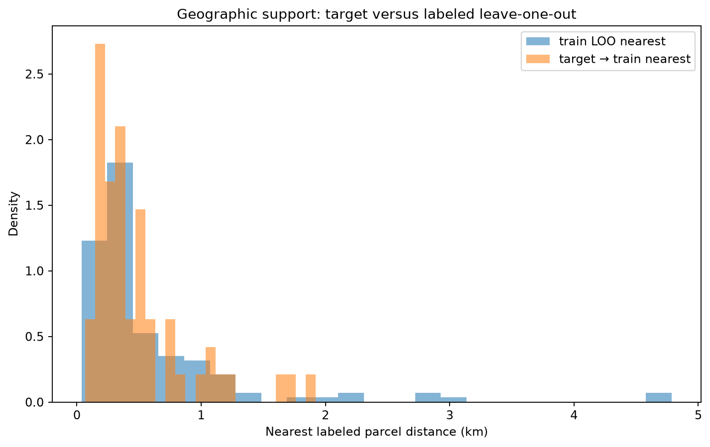

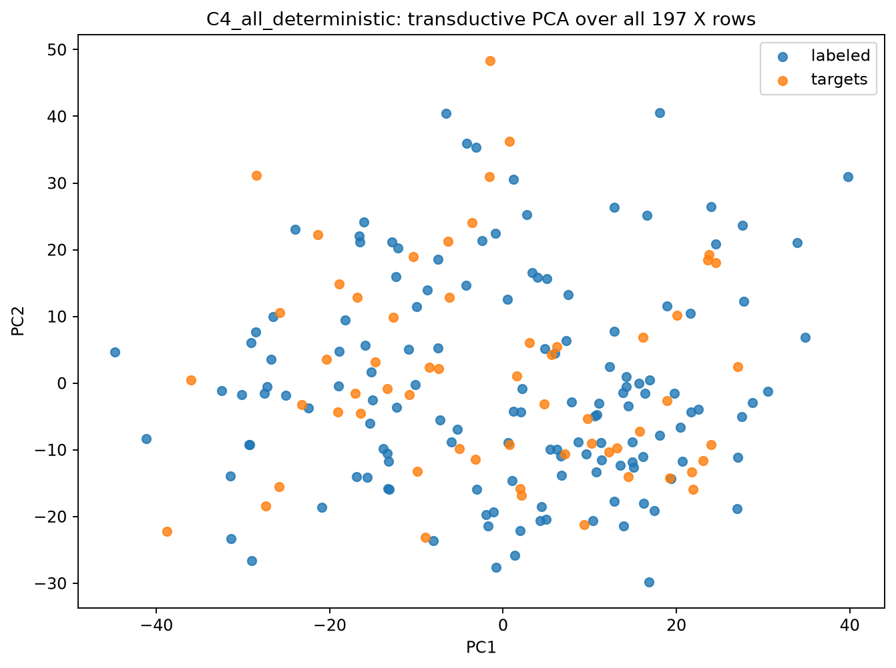

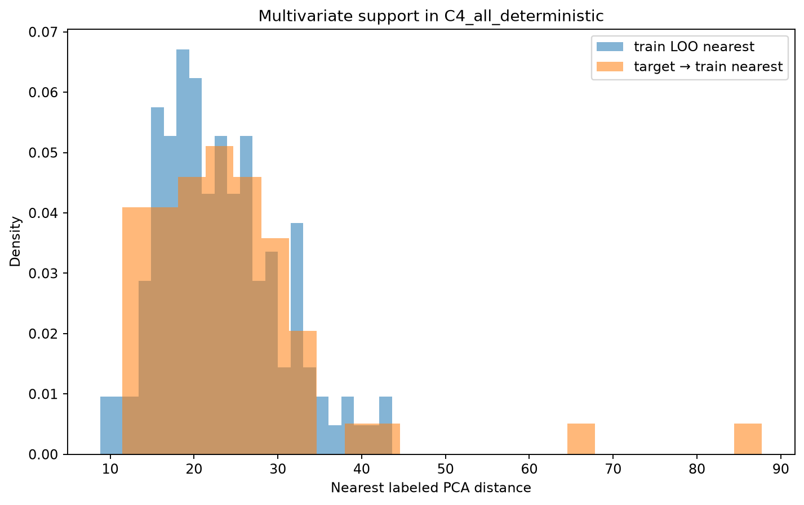

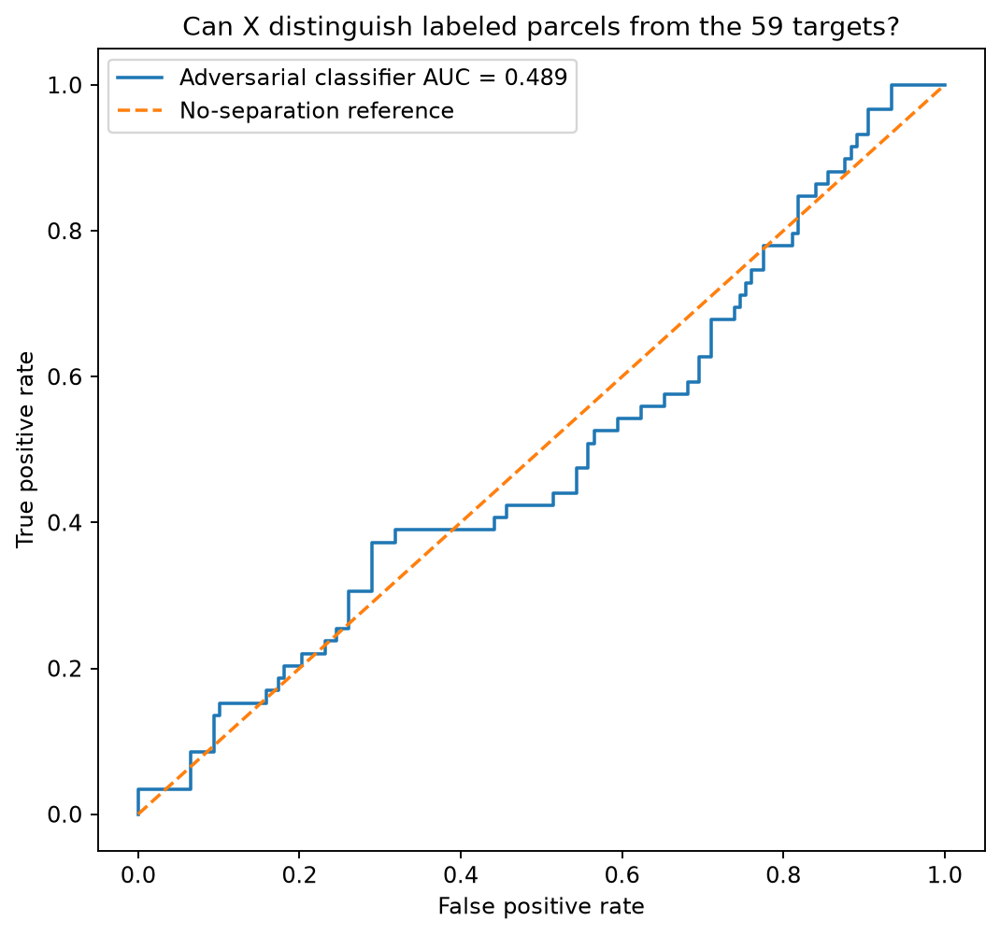

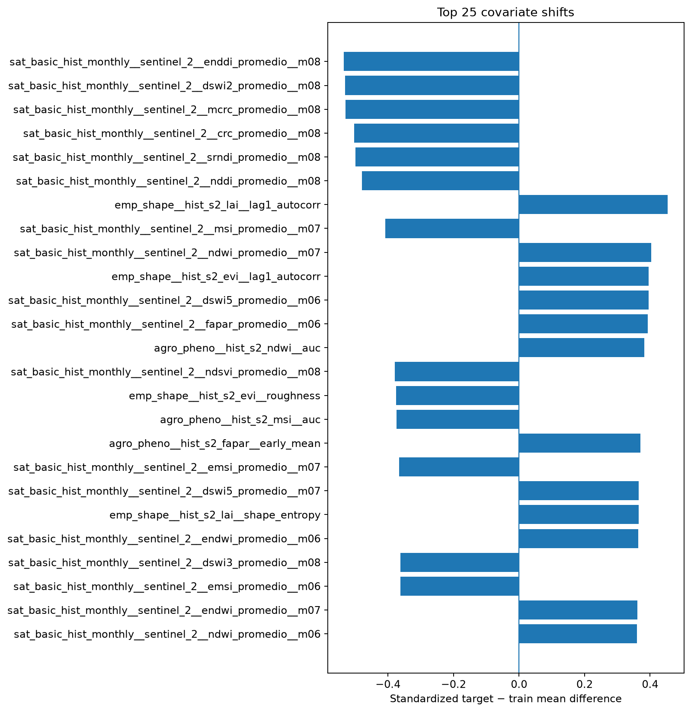

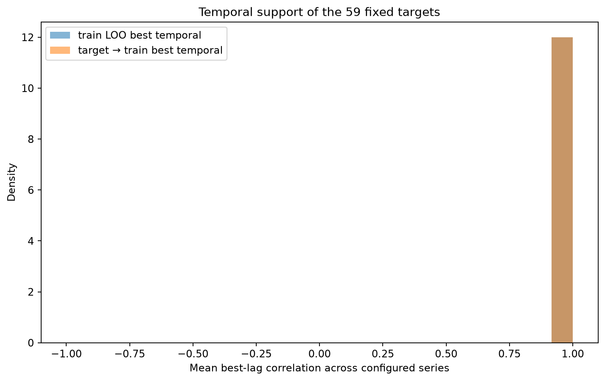

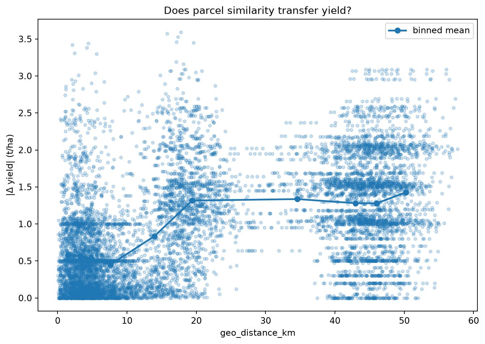

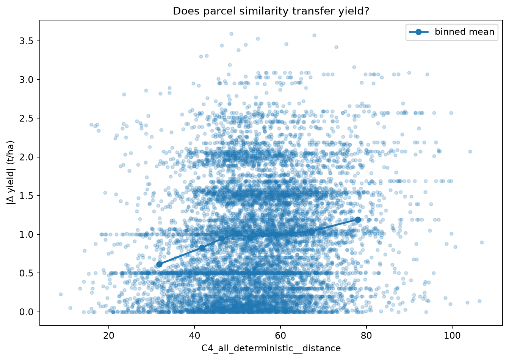

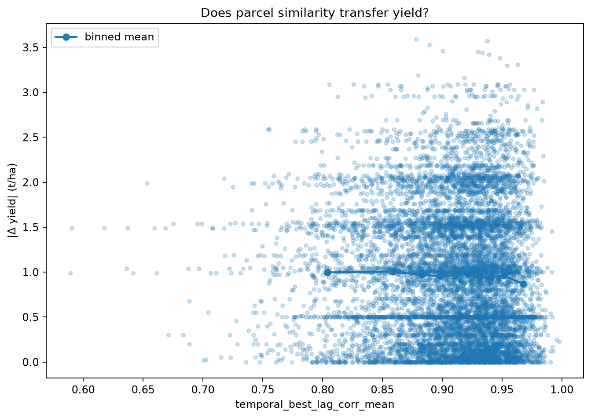

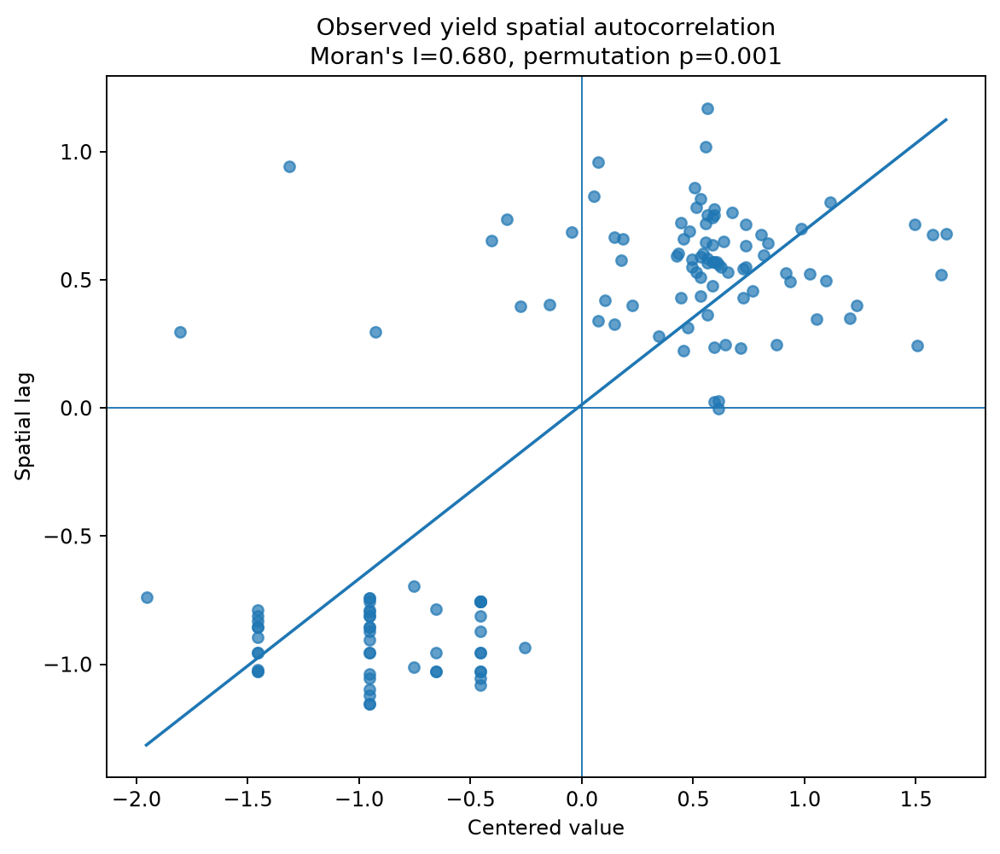

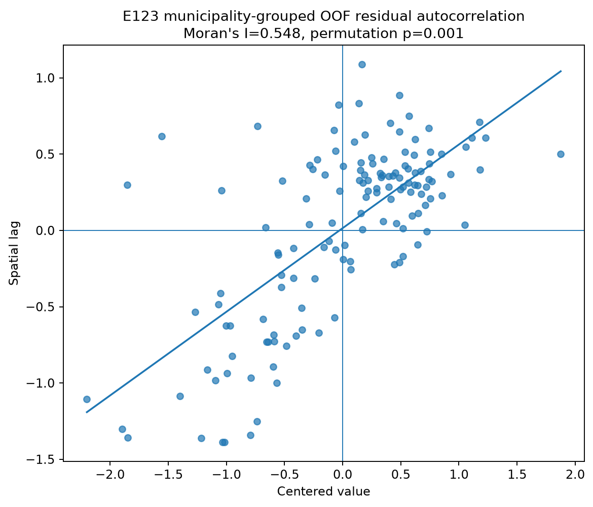

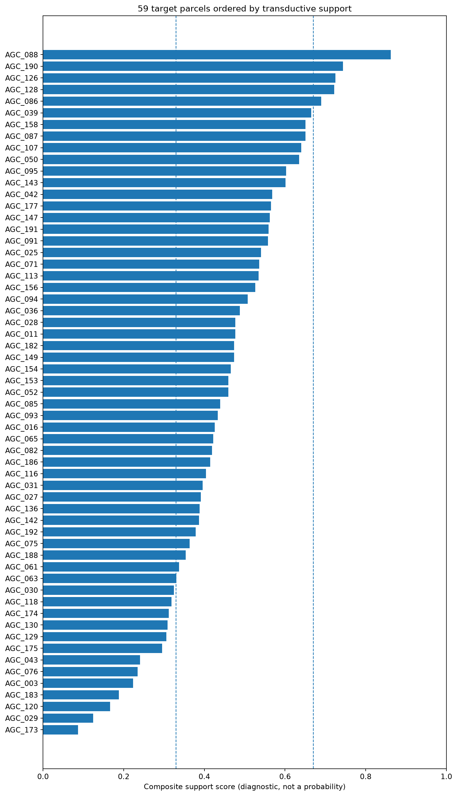

Individual target-versus-best-temporal-neighbor panels are in figures/target_temporal_panels.

## Boundary

- 04A does not predict the 59 yields.
- Neighbor yields are observed labels from the 138 training parcels only.
- Checkpoint 04B must convert these diagnostics into pseudo-competition RMSE.

