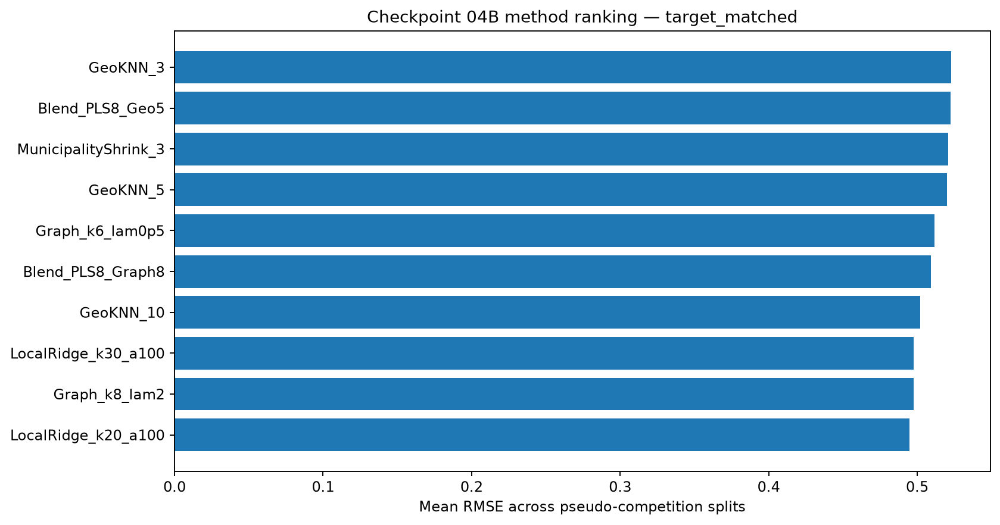
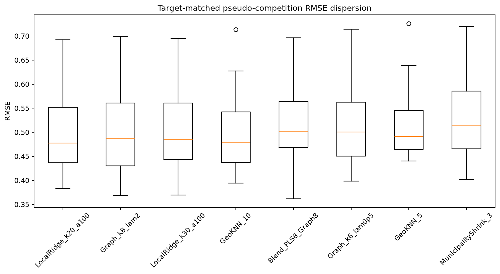
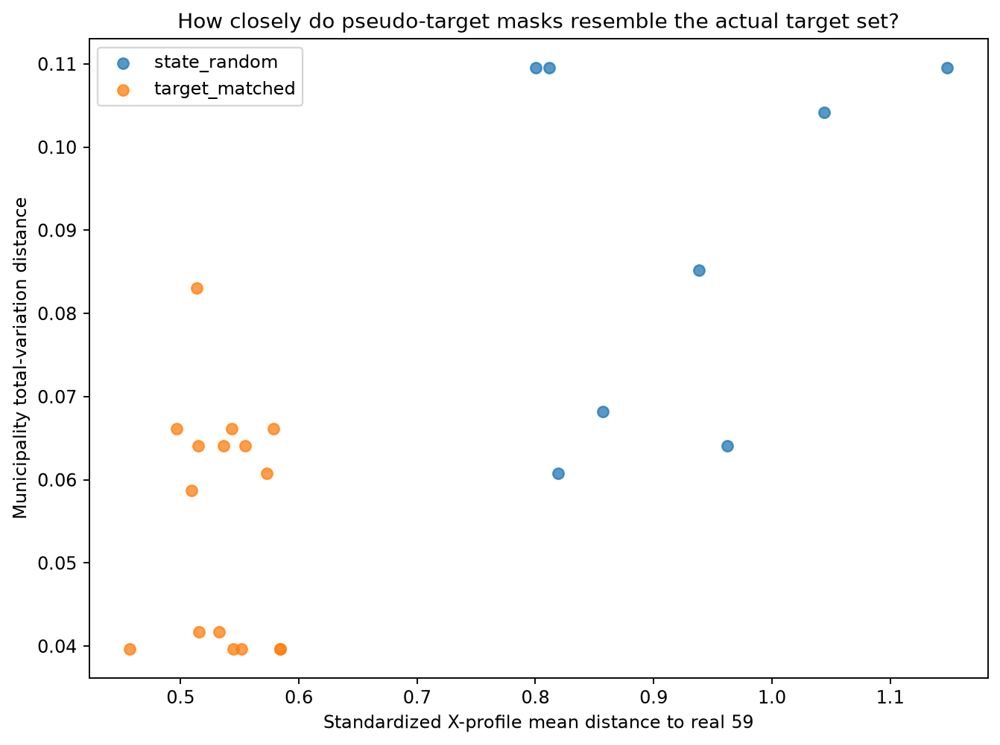
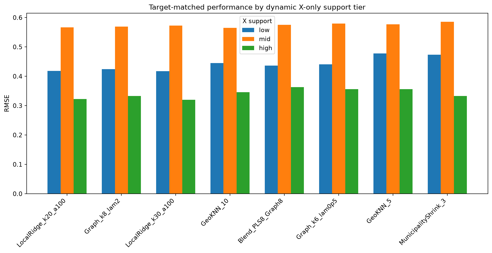
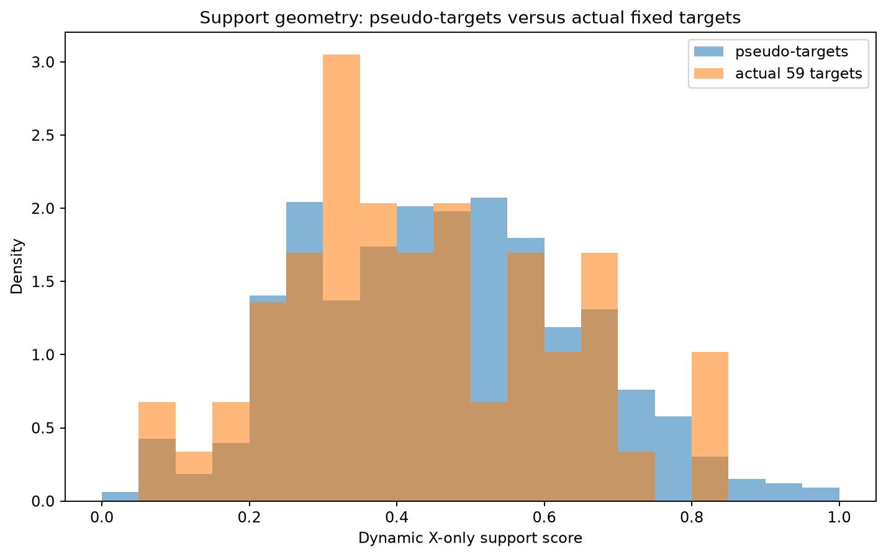
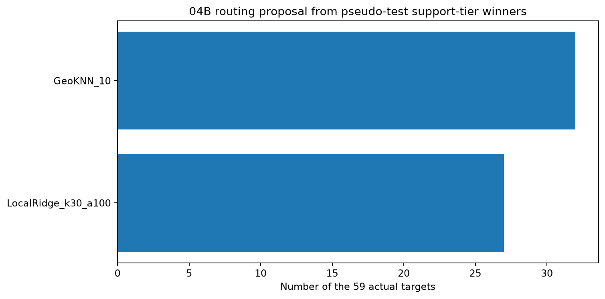
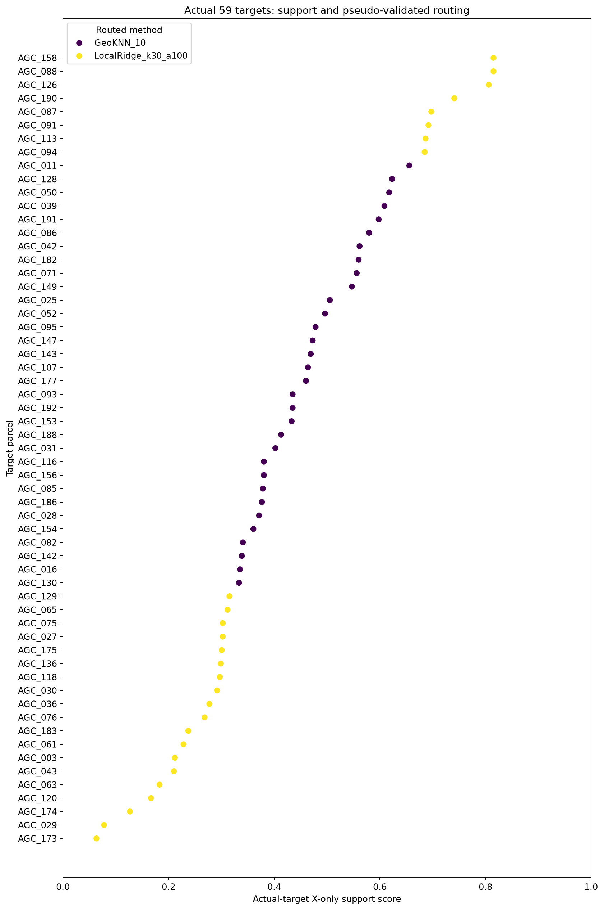

# Checkpoint 04B — Transductive pseudo-competition validation

Generated: 2026-09-21T01:08:30.150695+00:00
Git commit: fd16bd0bbc77d4cf2afaaece4fda6739a48aaa5b

## Validation contract

Each pseudo-competition hides y for selected labeled parcels but leaves their X visible.
All X-only PCA, distances, support calculations and graph topology may use the full 197-X universe.
Every y-aware estimator sees only the pseudo-training labels.

Primary split family: **target_matched**
Pseudo-targets per matched/random split: **41**
Target-matched repeats: **16**
State-random repeats: **8**
Legacy stress splits: **10**

## Does target matching improve the pseudo-test geometry?

- target-matched mean municipality TV: **0.0547**
- target-matched mean profile distance: **0.5369**
- state-random mean municipality TV: **0.0889**
- state-random mean profile distance: **0.9227**

## Primary target-matched ranking

| method | n_splits | rmse_mean | rmse_median | rmse_std | rmse_worst | mae_mean | r2_mean |
|---|---|---|---|---|---|---|---|
| LocalRidge_k20_a100 | 16 | 0.4946 | 0.4778 | 0.0901 | 0.6927 | 0.3450 | 0.6465 |
| Graph_k8_lam2 | 16 | 0.4974 | 0.4878 | 0.0943 | 0.6995 | 0.3512 | 0.6412 |
| LocalRidge_k30_a100 | 16 | 0.4976 | 0.4847 | 0.0918 | 0.6950 | 0.3420 | 0.6420 |
| GeoKNN_10 | 16 | 0.5021 | 0.4794 | 0.0845 | 0.7137 | 0.3654 | 0.6365 |
| Blend_PLS8_Graph8 | 16 | 0.5093 | 0.5012 | 0.0831 | 0.6968 | 0.3733 | 0.6263 |
| Graph_k6_lam0p5 | 16 | 0.5115 | 0.5006 | 0.0894 | 0.7141 | 0.3793 | 0.6219 |
| GeoKNN_5 | 16 | 0.5202 | 0.4912 | 0.0775 | 0.7261 | 0.3886 | 0.6102 |
| MunicipalityShrink_3 | 16 | 0.5208 | 0.5139 | 0.0917 | 0.7200 | 0.3570 | 0.6070 |
| Blend_PLS8_Geo5 | 16 | 0.5223 | 0.5216 | 0.0749 | 0.7101 | 0.3890 | 0.6078 |
| GeoKNN_3 | 16 | 0.5230 | 0.5007 | 0.0747 | 0.7107 | 0.3895 | 0.6059 |
| GeoAgro_25_75_KNN5 | 16 | 0.5232 | 0.5094 | 0.0771 | 0.7062 | 0.3908 | 0.6059 |
| GeoAgro_75_25_KNN5 | 16 | 0.5238 | 0.5022 | 0.0746 | 0.7189 | 0.3895 | 0.6053 |
| GeoAgro_50_50_KNN5 | 16 | 0.5246 | 0.5107 | 0.0783 | 0.7217 | 0.3926 | 0.6034 |
| GeoAgroTemporal_KNN5 | 16 | 0.5273 | 0.5082 | 0.0752 | 0.7231 | 0.3933 | 0.5991 |
| Blend_Ridge100_Geo5 | 16 | 0.5290 | 0.5210 | 0.0667 | 0.6697 | 0.3868 | 0.6005 |

## Robustness across split families

| method | target_matched | state_random | fold_state_stratified | fold_municipality_grouped | mean_family_rmse | worst_family_rmse |
|---|---|---|---|---|---|---|
| Graph_k8_lam2 | 0.4974 | 0.4655 | 0.4779 | 0.5466 | 0.4968 | 0.5466 |
| Blend_PLS8_Graph8 | 0.5093 | 0.4835 | 0.5210 | 0.5990 | 0.5282 | 0.5990 |
| GeoAgroTemporal_KNN5 | 0.5273 | 0.5073 | 0.5240 | 0.6216 | 0.5450 | 0.6216 |
| GeoAgro_50_50_KNN5 | 0.5246 | 0.5006 | 0.5110 | 0.6252 | 0.5404 | 0.6252 |
| GeoAgro_25_75_KNN5 | 0.5232 | 0.5078 | 0.5213 | 0.6280 | 0.5451 | 0.6280 |
| GeoAgro_75_25_KNN5 | 0.5238 | 0.4962 | 0.5065 | 0.6340 | 0.5401 | 0.6340 |
| GeoKNN_5 | 0.5202 | 0.4901 | 0.5047 | 0.6356 | 0.5376 | 0.6356 |
| Graph_k6_lam0p5 | 0.5115 | 0.4787 | 0.4964 | 0.6450 | 0.5329 | 0.6450 |
| GeoKNN_10 | 0.5021 | 0.4699 | 0.4866 | 0.6493 | 0.5270 | 0.6493 |
| Blend_PLS8_Geo5 | 0.5223 | 0.4986 | 0.5391 | 0.6499 | 0.5525 | 0.6499 |
| GeoKNN_3 | 0.5230 | 0.5011 | 0.5140 | 0.6717 | 0.5524 | 0.6717 |
| LocalRidge_k20_a100 | 0.4946 | 0.4768 | 0.4792 | 0.6925 | 0.5358 | 0.6925 |
| GlobalPLS_C0_4 | 0.5379 | 0.5017 | 0.5399 | 0.7107 | 0.5726 | 0.7107 |
| LocalRidge_k30_a100 | 0.4976 | 0.4790 | 0.4838 | 0.7226 | 0.5458 | 0.7226 |
| Blend_Ridge100_Geo5 | 0.5290 | 0.5242 | 0.5232 | 0.7275 | 0.5760 | 0.7275 |

## X-only support-tier routing

Routing is learned only from pseudo-target performance. The actual 59 hidden y values are never inspected.

| x_support_tier | recommended_method | pseudo_rmse | pseudo_mae | n_predictions |
|---|---|---|---|---|
| low | LocalRidge_k30_a100 | 0.4174 | 0.3170 | 178 |
| mid | GeoKNN_10 | 0.5645 | 0.3902 | 389 |
| high | LocalRidge_k30_a100 | 0.3198 | 0.2532 | 89 |

### Routing proposal for the actual 59 targets

| recommended_method | n_actual_targets |
|---|---|
| GeoKNN_10 | 32 |
| LocalRidge_k30_a100 | 27 |

## Figures

## Interpretation boundary

- 04B ranks methods with observed pseudo-target y only after predictions are frozen.
- Actual-target rows receive support/routing metadata only; no hidden yield is scored.
- Target-matched RMSE is the primary fixed-target simulation; legacy state/municipality folds remain stress tests.
- 04C may spend more compute only on globally competitive model families.
- 04D should refine local/graph mixtures only when 04B demonstrates pseudo-test gain.

