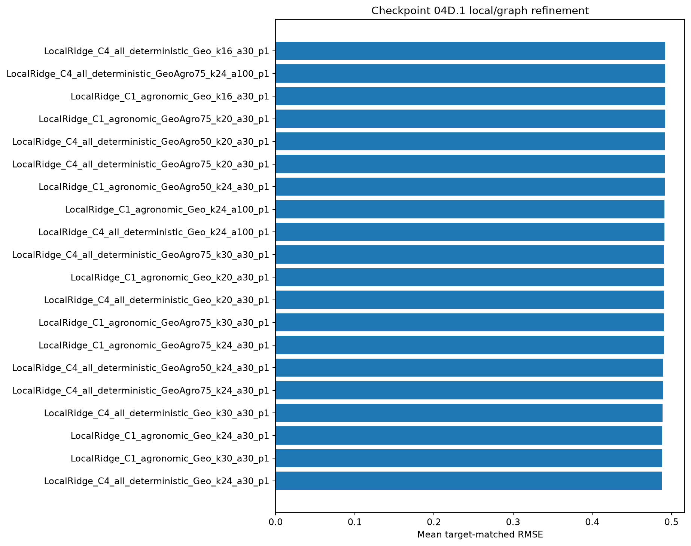
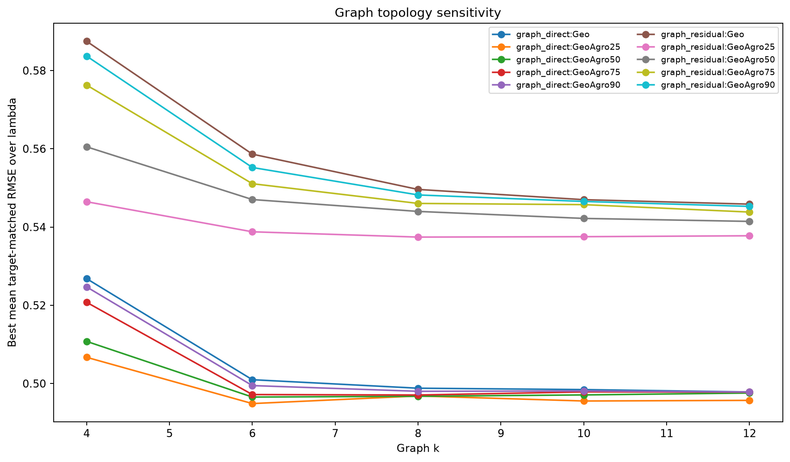
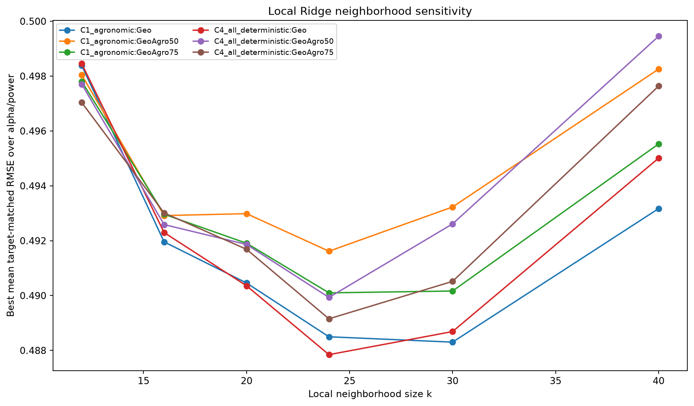
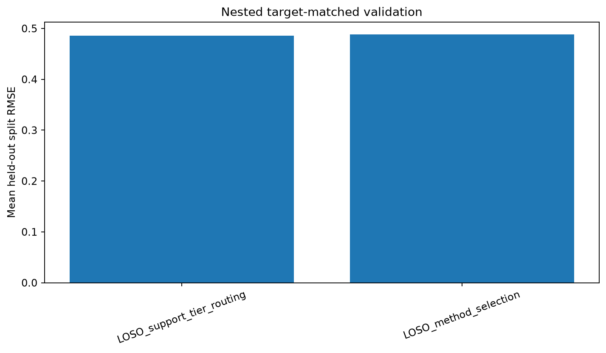
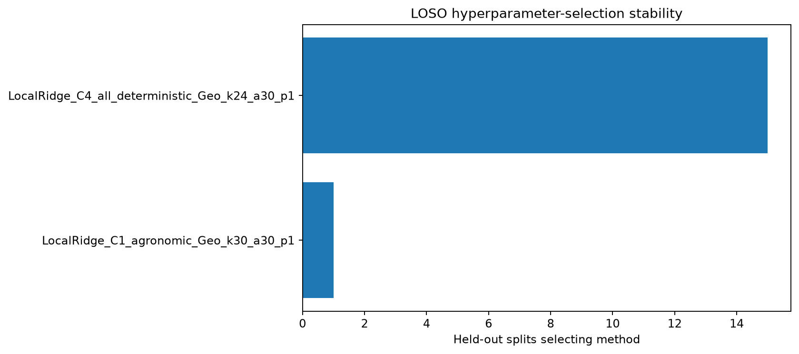
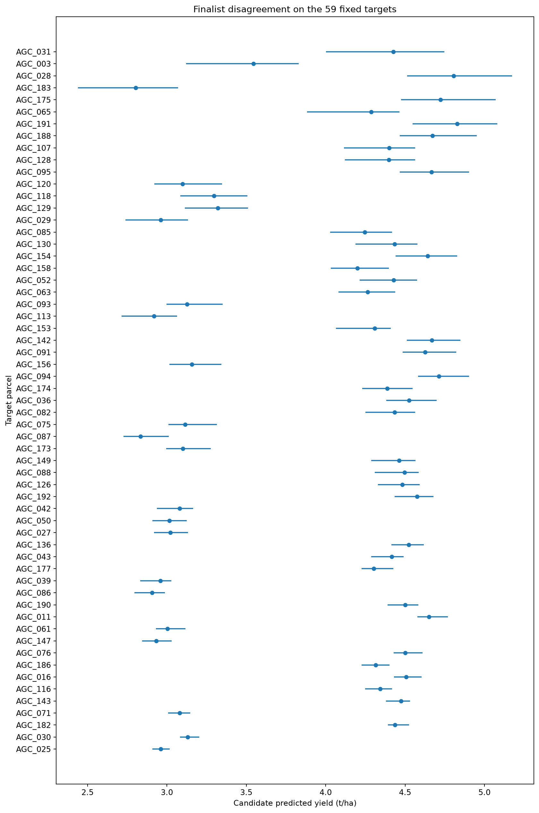

# Checkpoint 04D.1 — Local/graph refinement

Generated: 2026-09-21T02:44:22.271769+00:00
Git commit: b76f2167fe2a80482292cb125cb9b2c7ec2b1364

## Contract

04D.1 reuses the exact committed 04B pseudo-target memberships.
All topology and distance construction is X-only and may use the full 197-X universe.
Every y-aware fit sees only the labels visible in the corresponding pseudo split.

## Primary target-matched search

| method | method_family | rmse_mean | rmse_median | rmse_std | rmse_worst | pooled_mae |
|---|---|---|---|---|---|---|
| LocalRidge_C4_all_deterministic_Geo_k24_a30_p1 | local | 0.4878 | 0.4687 | 0.0910 | 0.6947 | 0.3425 |
| LocalRidge_C1_agronomic_Geo_k30_a30_p1 | local | 0.4883 | 0.4694 | 0.0894 | 0.6921 | 0.3423 |
| LocalRidge_C1_agronomic_Geo_k24_a30_p1 | local | 0.4885 | 0.4684 | 0.0906 | 0.6953 | 0.3447 |
| LocalRidge_C4_all_deterministic_Geo_k30_a30_p1 | local | 0.4887 | 0.4715 | 0.0896 | 0.6925 | 0.3404 |
| LocalRidge_C4_all_deterministic_GeoAgro75_k24_a30_p1 | local | 0.4892 | 0.4718 | 0.0917 | 0.6940 | 0.3401 |
| LocalRidge_C4_all_deterministic_GeoAgro50_k24_a30_p1 | local | 0.4899 | 0.4744 | 0.0913 | 0.6920 | 0.3383 |
| LocalRidge_C1_agronomic_GeoAgro75_k24_a30_p1 | local | 0.4901 | 0.4722 | 0.0912 | 0.6946 | 0.3441 |
| LocalRidge_C1_agronomic_GeoAgro75_k30_a30_p1 | local | 0.4902 | 0.4748 | 0.0908 | 0.6917 | 0.3410 |
| LocalRidge_C4_all_deterministic_Geo_k20_a30_p1 | local | 0.4904 | 0.4696 | 0.0892 | 0.6973 | 0.3489 |
| LocalRidge_C1_agronomic_Geo_k20_a30_p1 | local | 0.4905 | 0.4682 | 0.0889 | 0.6962 | 0.3497 |
| LocalRidge_C4_all_deterministic_GeoAgro75_k30_a30_p1 | local | 0.4905 | 0.4754 | 0.0909 | 0.6925 | 0.3389 |
| LocalRidge_C4_all_deterministic_Geo_k24_a100_p1 | local | 0.4910 | 0.4739 | 0.0912 | 0.6965 | 0.3432 |
| LocalRidge_C1_agronomic_Geo_k24_a100_p1 | local | 0.4912 | 0.4733 | 0.0911 | 0.6966 | 0.3439 |
| LocalRidge_C1_agronomic_GeoAgro50_k24_a30_p1 | local | 0.4916 | 0.4765 | 0.0915 | 0.6954 | 0.3426 |
| LocalRidge_C4_all_deterministic_GeoAgro75_k20_a30_p1 | local | 0.4917 | 0.4738 | 0.0894 | 0.6938 | 0.3472 |
| LocalRidge_C4_all_deterministic_GeoAgro50_k20_a30_p1 | local | 0.4919 | 0.4743 | 0.0894 | 0.6904 | 0.3449 |
| LocalRidge_C1_agronomic_GeoAgro75_k20_a30_p1 | local | 0.4919 | 0.4719 | 0.0895 | 0.6951 | 0.3495 |
| LocalRidge_C1_agronomic_Geo_k16_a30_p1 | local | 0.4920 | 0.4695 | 0.0867 | 0.6971 | 0.3559 |
| LocalRidge_C4_all_deterministic_GeoAgro75_k24_a100_p1 | local | 0.4923 | 0.4765 | 0.0921 | 0.6952 | 0.3406 |
| LocalRidge_C4_all_deterministic_Geo_k16_a30_p1 | local | 0.4923 | 0.4720 | 0.0857 | 0.6955 | 0.3557 |

## Finalists and stress robustness

| method | target_matched | state_random | fold_state_stratified | fold_municipality_grouped | mean_family_rmse | worst_family_rmse |
|---|---|---|---|---|---|---|
| GraphDirect_GeoAgro25_k6_lam8 | 0.4949 | 0.4679 | 0.4792 | 0.5279 | 0.4925 | 0.5279 |
| GraphDirect_GeoAgro25_k10_lam2 | 0.4955 | 0.4674 | 0.4789 | 0.5292 | 0.4928 | 0.5292 |
| GraphDirect_GeoAgro25_k6_lam4 | 0.4951 | 0.4670 | 0.4786 | 0.5343 | 0.4937 | 0.5343 |
| Baseline_GeoKNN10 | 0.5021 | 0.4699 | 0.4866 | 0.6493 | 0.5270 | 0.6493 |
| GraphResidualPLS4_GeoAgro25_k8_lam8 | 0.5374 | 0.4915 | 0.5216 | 0.6788 | 0.5573 | 0.6788 |
| GraphResidualPLS4_GeoAgro25_k10_lam8 | 0.5375 | 0.4915 | 0.5223 | 0.6839 | 0.5588 | 0.6839 |
| GraphResidualPLS4_GeoAgro25_k12_lam4 | 0.5378 | 0.4919 | 0.5226 | 0.6841 | 0.5591 | 0.6841 |
| LocalRidge_C4_all_deterministic_Geo_k24_a30_p1 | 0.4878 | 0.4710 | 0.4754 | 0.6870 | 0.5303 | 0.6870 |
| LocalRidge_C1_agronomic_Geo_k24_a30_p1 | 0.4885 | 0.4737 | 0.4751 | 0.6884 | 0.5314 | 0.6884 |
| Anchor_PLS4 | 0.5379 | 0.5017 | 0.5399 | 0.7107 | 0.5726 | 0.7107 |
| LocalRidge_C1_agronomic_Geo_k30_a30_p1 | 0.4883 | 0.4710 | 0.4756 | 0.7194 | 0.5386 | 0.7194 |

## Leave-one-split-out validation

| label | n_splits | n_predictions | rmse_mean | rmse_median | rmse_worst | pooled_rmse | pooled_mae |
|---|---|---|---|---|---|---|---|
| LOSO_method_selection | 16 | 656 | 0.4884 | 0.4687 | 0.6947 | 0.4961 | 0.3425 |
| LOSO_support_tier_routing | 16 | 656 | 0.4858 | 0.4685 | 0.6936 | 0.4942 | 0.3378 |

The LOSO procedure chooses hyperparameters or support-tier routes using the other
target-matched splits and scores the held-out split only afterward. Because repeated
pseudo-splits reuse parcels, this removes direct same-split tuning optimism but is not
equivalent to 16 statistically independent experiments.

## Exploratory route fitted on all primary splits

| x_support_tier | selected_method | selection_rmse |
|---|---|---|
| low | LocalRidge_C4_all_deterministic_Geo_k24_a30_p1 | 0.4014 |
| mid | LocalRidge_C4_all_deterministic_Geo_k24_a30_p1 | 0.5492 |
| high | LocalRidge_C1_agronomic_Geo_k30_a30_p1 | 0.2970 |

This all-split route is a candidate for later reconstruction, not a hidden-y result.

## Finalist manifest

| method | method_family | representation | distance_name | k | alpha | distance_power | regularization |
|---|---|---|---|---|---|---|---|
| Baseline_GeoKNN10 | baseline |  | Geo | 10.0000 |  | 1.0000 |  |
| Anchor_PLS4 | baseline | C0_base |  |  |  |  |  |
| GraphDirect_GeoAgro25_k6_lam8 | graph_direct |  | GeoAgro25 | 6.0000 |  |  | 8.0000 |
| GraphDirect_GeoAgro25_k6_lam4 | graph_direct |  | GeoAgro25 | 6.0000 |  |  | 4.0000 |
| GraphDirect_GeoAgro25_k10_lam2 | graph_direct |  | GeoAgro25 | 10.0000 |  |  | 2.0000 |
| GraphResidualPLS4_GeoAgro25_k8_lam8 | graph_residual | C0_base | GeoAgro25 | 8.0000 |  |  | 8.0000 |
| GraphResidualPLS4_GeoAgro25_k10_lam8 | graph_residual | C0_base | GeoAgro25 | 10.0000 |  |  | 8.0000 |
| GraphResidualPLS4_GeoAgro25_k12_lam4 | graph_residual | C0_base | GeoAgro25 | 12.0000 |  |  | 4.0000 |
| LocalRidge_C4_all_deterministic_Geo_k24_a30_p1 | local | C4_all_deterministic | Geo | 24.0000 | 30.0000 | 1.0000 |  |
| LocalRidge_C1_agronomic_Geo_k30_a30_p1 | local | C1_agronomic | Geo | 30.0000 | 30.0000 | 1.0000 |  |
| LocalRidge_C1_agronomic_Geo_k24_a30_p1 | local | C1_agronomic | Geo | 24.0000 | 30.0000 | 1.0000 |  |

## Figures

## Interpretation boundary

- No hidden FIRA yield is read or scored.
- Actual-target predictions are candidate predictions from validated finalists.
- They are not the final 04F submission.
- SIAP/external localization remains a separate 04E hypothesis.

