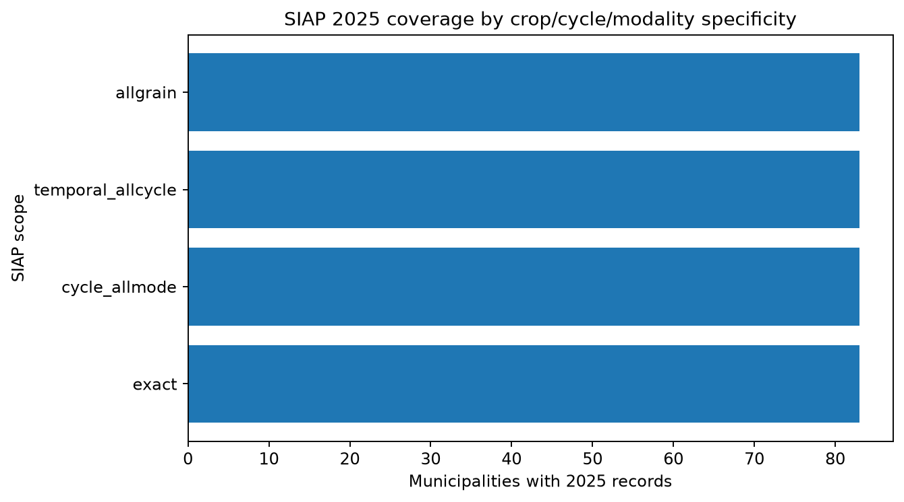
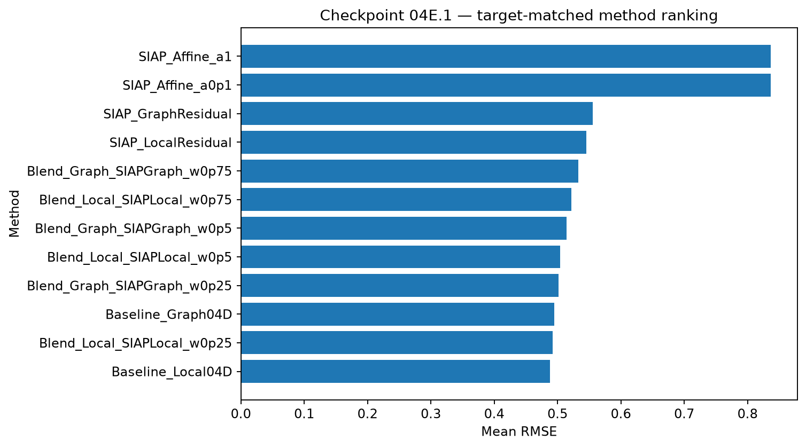
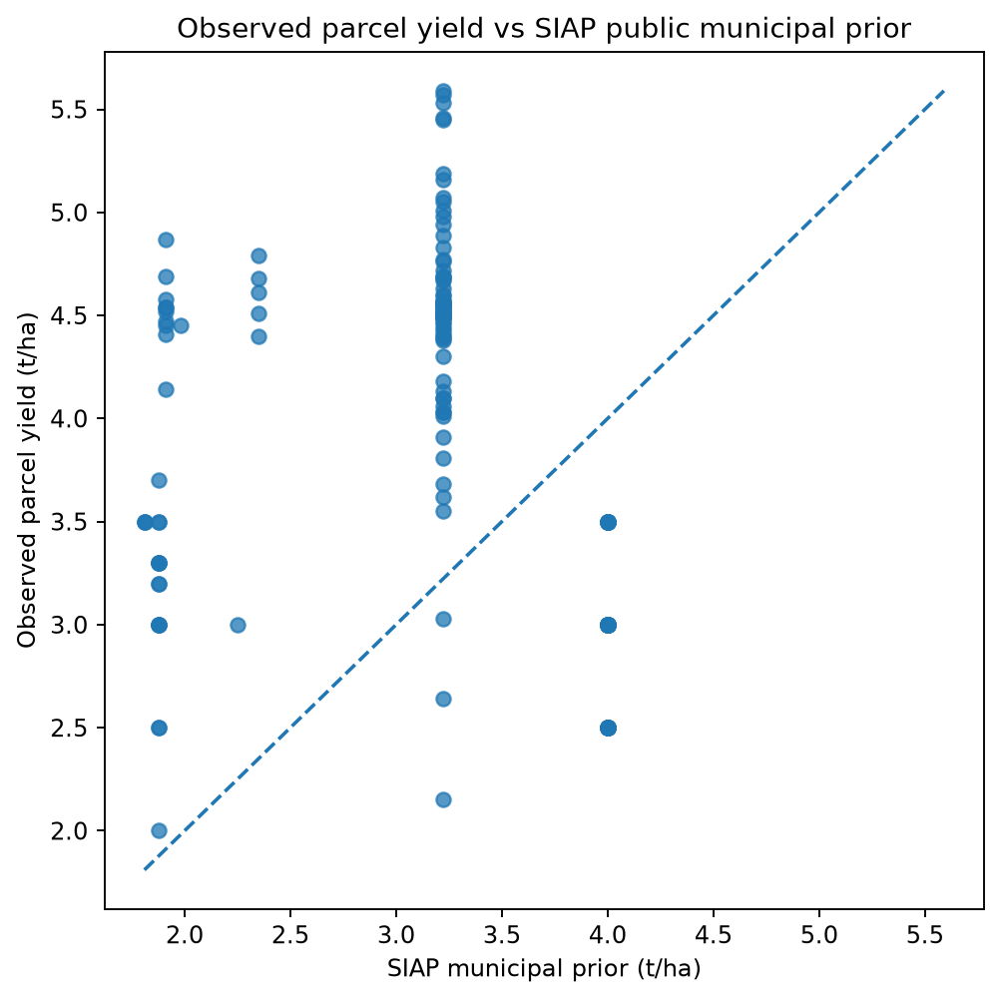

# Checkpoint 04E.1 — SIAP external localization

Generated: 2026-09-21T03:45:32.617757+00:00
Git commit: 4f7fd258ee8a9ff7ba7cb7c68834ef7e249f79d9

## Information boundary

The 2025 SIAP municipal closure is public external competition-mode evidence.
No hidden parcel yield is loaded or scored. Pseudo-target y is revealed only after
predictions are frozen for each committed 04B split.

## SIAP scope audit

| scope | cycle | modality | rows_all_years | municipalities_2025 | rows_2025 |
|---|---|---|---|---|---|
| exact | Primavera-Verano | Temporal | 924 | 83 | 83 |
| cycle_allmode | Primavera-Verano | ALL | 925 | 83 | 93 |
| temporal_allcycle | ALL | Temporal | 929 | 83 | 83 |
| allgrain | ALL | ALL | 930 | 83 | 94 |

Exact parcel coverage: **197/197**.
Selected-prior parcel coverage before median fallback: **197/197**.
Actual-target selected-prior coverage: **59/59**.

## Primary target-matched ranking

| method | rmse_mean | rmse_median | rmse_std | rmse_worst | pooled_mae |
|---|---|---|---|---|---|
| Baseline_Local04D | 0.4878 | 0.4687 | 0.0910 | 0.6947 | 0.3425 |
| Blend_Local_SIAPLocal_w0p25 | 0.4922 | 0.4765 | 0.0881 | 0.6979 | 0.3528 |
| Baseline_Graph04D | 0.4949 | 0.4817 | 0.0949 | 0.6941 | 0.3403 |
| Blend_Graph_SIAPGraph_w0p25 | 0.5014 | 0.4907 | 0.0931 | 0.7013 | 0.3500 |
| Blend_Local_SIAPLocal_w0p5 | 0.5038 | 0.4962 | 0.0850 | 0.7125 | 0.3727 |
| Blend_Graph_SIAPGraph_w0p5 | 0.5143 | 0.5092 | 0.0916 | 0.7199 | 0.3652 |
| Blend_Local_SIAPLocal_w0p75 | 0.5219 | 0.5239 | 0.0836 | 0.7378 | 0.3938 |
| Blend_Graph_SIAPGraph_w0p75 | 0.5327 | 0.5237 | 0.0922 | 0.7491 | 0.3813 |
| SIAP_LocalResidual | 0.5456 | 0.5395 | 0.0858 | 0.7727 | 0.4151 |
| SIAP_GraphResidual | 0.5558 | 0.5537 | 0.0963 | 0.7877 | 0.3976 |
| SIAP_Affine_a0p1 | 0.8366 | 0.8294 | 0.0499 | 0.9256 | 0.7166 |
| SIAP_Affine_a1 | 0.8367 | 0.8295 | 0.0498 | 0.9258 | 0.7169 |
| SIAP_Affine_a10 | 0.8378 | 0.8307 | 0.0490 | 0.9279 | 0.7196 |
| SIAP_Direct | 1.4368 | 1.4285 | 0.0572 | 1.5520 | 1.3095 |

## Leave-one-split-out method selection

- mean RMSE: **0.4878**
- median RMSE: **0.4687**
- worst split RMSE: **0.6947**
- pooled RMSE: **0.4957**

## Full-label proxy diagnostics

- SIAP selected prior direct RMSE on the 138 observed parcels: **1.4926**
- Spearman(prior, observed yield): **-0.2181**
- legacy aggregated SIAP 2025 direct RMSE: **1.4894**

## Interpretation boundary

- Exact SIAP means Cebada grano + Primavera-Verano + Temporal + CVEGEO.
- Broader SIAP scopes are explicit fallbacks, never silently mixed into the exact audit.
- Actual 59 predictions written here are candidates for 04F, not the final submission.
- 04E.1 decides whether the external municipal prior adds validated information beyond 04D.1.

## Figures

